# TeamLoom — Feature Flow Diagrams

Generated from the 27 specs in [`specs/`](../specs). Each diagram shows the primary (P1)
flow(s) for that feature plus its most important branch conditions, taken directly from that
spec's Acceptance Scenarios and Edge Cases — nothing here is invented beyond what's written in
the spec. Where a spec left a detail unspecified, the diagram doesn't fabricate one; see
[`feature.md`](./feature.md) for the corresponding `TODO` gap flag instead.

See also: [`feature.md`](./feature.md) for the per-feature Inputs/Outputs/Dependencies table
this file's diagrams are drawn from.

## Dependency graph (build-order validation)

Every arrow means "depends on" (source needs target). This is the whole 27-spec roadmap in one
view, grouped by tranche.

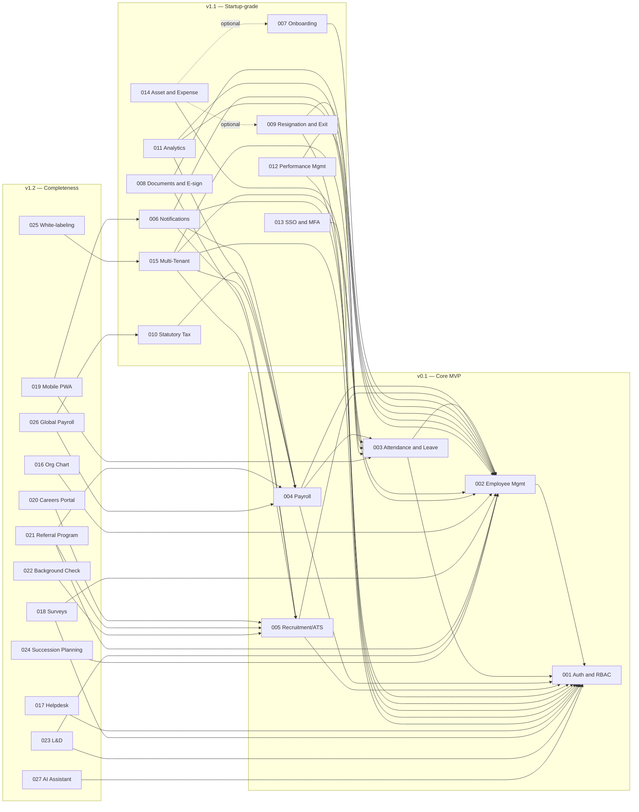
```mermaid
flowchart LR
    subgraph v01["v0.1 — Core MVP"]
        F001["001 Auth and RBAC"]
        F002["002 Employee Mgmt"]
        F003["003 Attendance and Leave"]
        F004["004 Payroll"]
        F005["005 Recruitment/ATS"]
    end
    subgraph v11["v1.1 — Startup-grade"]
        F006["006 Notifications"]
        F007["007 Onboarding"]
        F008["008 Documents and E-sign"]
        F009["009 Resignation and Exit"]
        F010["010 Statutory Tax"]
        F011["011 Analytics"]
        F012["012 Performance Mgmt"]
        F013["013 SSO and MFA"]
        F014["014 Asset and Expense"]
        F015["015 Multi-Tenant"]
    end
    subgraph v12["v1.2 — Completeness"]
        F016["016 Org Chart"]
        F017["017 Helpdesk"]
        F018["018 Surveys"]
        F019["019 Mobile PWA"]
        F020["020 Careers Portal"]
        F021["021 Referral Program"]
        F022["022 Background Check"]
        F023["023 L&D"]
        F024["024 Succession Planning"]
        F025["025 White-labeling"]
        F026["026 Global Payroll"]
        F027["027 AI Assistant"]
    end

    F002 --> F001
    F003 --> F001
    F003 --> F002
    F004 --> F001
    F004 --> F002
    F004 --> F003
    F005 --> F001
    F005 --> F002

    F006 --> F001
    F006 --> F003
    F006 --> F004
    F006 --> F005
    F007 --> F002
    F008 --> F002
    F008 --> F005
    F009 --> F001
    F009 --> F002
    F010 --> F004
    F011 --> F002
    F011 --> F003
    F011 --> F004
    F012 --> F001
    F012 --> F002
    F013 --> F001
    F014 --> F002
    F014 -. optional .-> F007
    F014 -. optional .-> F009
    F015 --> F001
    F015 --> F002
    F015 --> F003
    F015 --> F004
    F015 --> F005

    F016 --> F002
    F017 --> F001
    F018 --> F001
    F018 --> F002
    F019 --> F003
    F019 --> F006
    F020 --> F005
    F021 --> F002
    F021 --> F004
    F021 --> F005
    F022 --> F005
    F023 --> F001
    F023 --> F002
    F024 --> F002
    F025 --> F015
    F026 --> F004
    F026 --> F010
    F027 --> F001
```

**Build-order validation**: the numeric spec order (001 → 027) already respects every
dependency above — nothing depends on a higher-numbered spec except the two soft/optional
pairings shown with dotted arrows (014 ↔ 007/009, which the specs themselves say are
non-blocking). Building in numeric order will not break on a forward reference.

**⚠️ One real gap, flagged per this task's "don't break on upcoming features" instruction**:
[015-multi-tenant-activation](../specs/015-multi-tenant-activation/spec.md) was written when
only specs 001–014 existed. Its own text (Assumptions, FR-002, FR-010) scopes its
"every existing module" isolation requirement — and its automated cross-org-leakage test
suite — to **001–014 only**. Specs 016–027 did not exist yet and are not mentioned. This
schema update adds `orgId` to every new 016–027 model (consistent with Constitution Principle
VI) so the *data* is already tenant-scoped, but **015's own acceptance tests and FR-002/FR-010
wording must be re-extended to cover 016–027's endpoints** when those are implemented — do not
assume 015's original test suite still proves isolation once later features land. Track this
as a standing TODO on 015, not a one-time fix.

A second, smaller consequence of the same gap: 013's `IdentityProviderConfig` and break-glass
account are `orgId`-scoped in this schema, but 013's spec text was also written before 015
existed and doesn't say "per organization" anywhere — treat that as implied, not stated.

---

## v0.1 — Core MVP

### 001 — Authentication & Role-Based Access

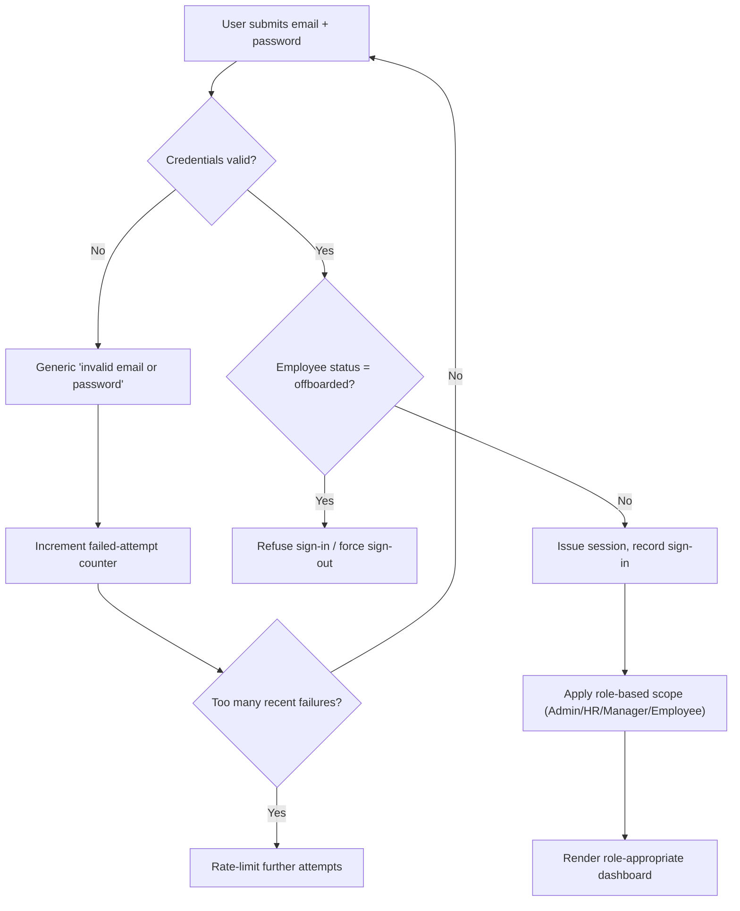
```mermaid
flowchart TD
    A["User submits email + password"] --> B{"Credentials valid?"}
    B -- "No" --> C["Generic 'invalid email or password'"]
    C --> D["Increment failed-attempt counter"]
    D --> E{"Too many recent failures?"}
    E -- "Yes" --> F["Rate-limit further attempts"]
    E -- "No" --> A
    B -- "Yes" --> G{"Employee status = offboarded?"}
    G -- "Yes" --> H["Refuse sign-in / force sign-out"]
    G -- "No" --> I["Issue session, record sign-in"]
    I --> J["Apply role-based scope (Admin/HR/Manager/Employee)"]
    J --> K["Render role-appropriate dashboard"]
```

### 002 — Employee Management

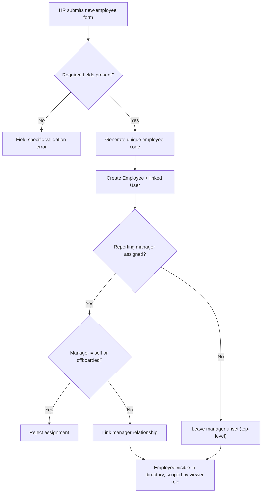
```mermaid
flowchart TD
    A["HR submits new-employee form"] --> B{"Required fields present?"}
    B -- "No" --> C["Field-specific validation error"]
    B -- "Yes" --> D["Generate unique employee code"]
    D --> E["Create Employee + linked User"]
    E --> F{"Reporting manager assigned?"}
    F -- "Yes" --> G{"Manager = self or offboarded?"}
    G -- "Yes" --> H["Reject assignment"]
    G -- "No" --> I["Link manager relationship"]
    F -- "No" --> J["Leave manager unset (top-level)"]
    I --> K["Employee visible in directory, scoped by viewer role"]
    J --> K
```

### 003 — Attendance & Leave

Check-in / check-out:

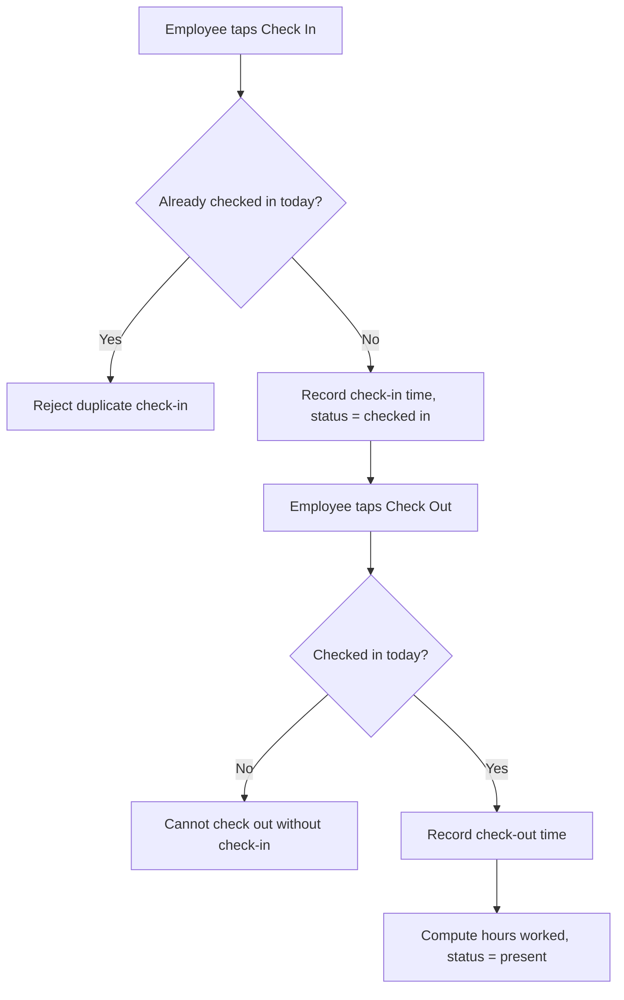
```mermaid
flowchart TD
    A["Employee taps Check In"] --> B{"Already checked in today?"}
    B -- "Yes" --> C["Reject duplicate check-in"]
    B -- "No" --> D["Record check-in time, status = checked in"]
    D --> E["Employee taps Check Out"]
    E --> F{"Checked in today?"}
    F -- "No" --> G["Cannot check out without check-in"]
    F -- "Yes" --> H["Record check-out time"]
    H --> I["Compute hours worked, status = present"]
```

Leave request → approval:

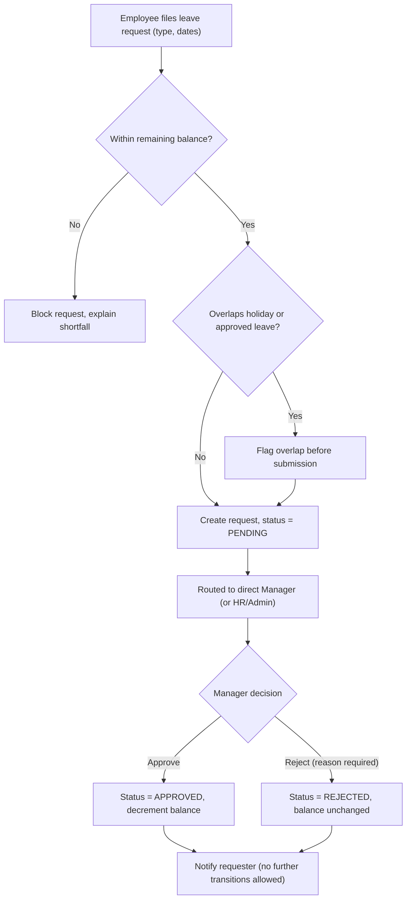
```mermaid
flowchart TD
    A["Employee files leave request (type, dates)"] --> B{"Within remaining balance?"}
    B -- "No" --> C["Block request, explain shortfall"]
    B -- "Yes" --> D{"Overlaps holiday or approved leave?"}
    D -- "Yes" --> E["Flag overlap before submission"]
    D -- "No" --> F["Create request, status = PENDING"]
    E --> F
    F --> G["Routed to direct Manager (or HR/Admin)"]
    G --> H{"Manager decision"}
    H -- "Approve" --> I["Status = APPROVED, decrement balance"]
    H -- "Reject (reason required)" --> J["Status = REJECTED, balance unchanged"]
    I --> K["Notify requester (no further transitions allowed)"]
    J --> K
```

### 004 — Payroll

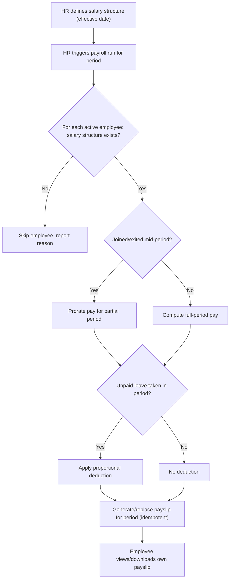
```mermaid
flowchart TD
    A["HR defines salary structure (effective date)"] --> B["HR triggers payroll run for period"]
    B --> C{"For each active employee: salary structure exists?"}
    C -- "No" --> D["Skip employee, report reason"]
    C -- "Yes" --> E{"Joined/exited mid-period?"}
    E -- "Yes" --> F["Prorate pay for partial period"]
    E -- "No" --> G["Compute full-period pay"]
    F --> H{"Unpaid leave taken in period?"}
    G --> H
    H -- "Yes" --> I["Apply proportional deduction"]
    H -- "No" --> J["No deduction"]
    I --> K["Generate/replace payslip for period (idempotent)"]
    J --> K
    K --> L["Employee views/downloads own payslip"]
```

### 005 — Recruitment / ATS

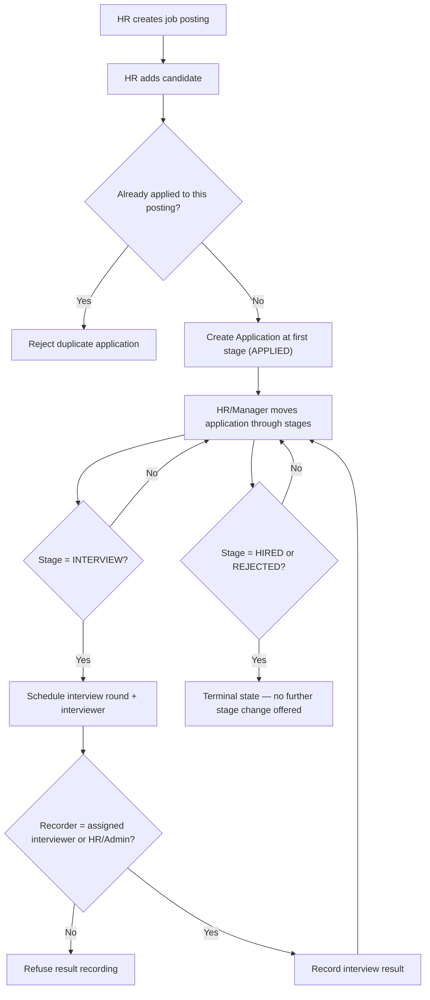
```mermaid
flowchart TD
    A["HR creates job posting"] --> B["HR adds candidate"]
    B --> C{"Already applied to this posting?"}
    C -- "Yes" --> D["Reject duplicate application"]
    C -- "No" --> E["Create Application at first stage (APPLIED)"]
    E --> F["HR/Manager moves application through stages"]
    F --> G{"Stage = INTERVIEW?"}
    G -- "Yes" --> H["Schedule interview round + interviewer"]
    H --> I{"Recorder = assigned interviewer or HR/Admin?"}
    I -- "No" --> J["Refuse result recording"]
    I -- "Yes" --> K["Record interview result"]
    K --> F
    G -- "No" --> F
    F --> L{"Stage = HIRED or REJECTED?"}
    L -- "Yes" --> M["Terminal state — no further stage change offered"]
    L -- "No" --> F
```

---

## v1.1 — Startup-grade additions

### 006 — Notifications

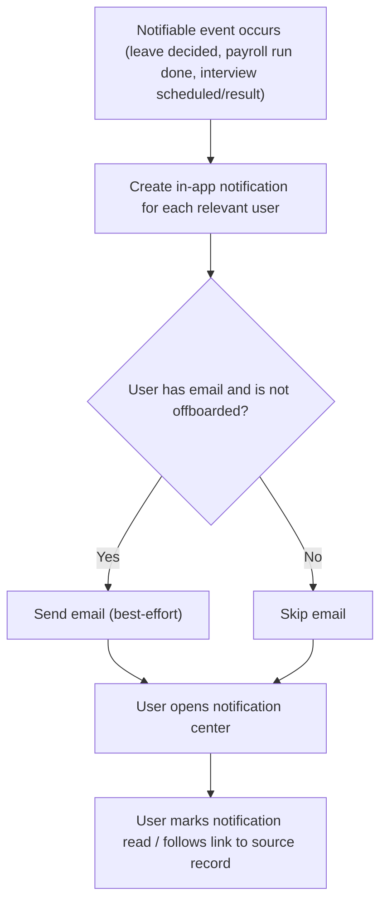
```mermaid
flowchart TD
    A["Notifiable event occurs (leave decided, payroll run done, interview scheduled/result)"] --> B["Create in-app notification for each relevant user"]
    B --> C{"User has email and is not offboarded?"}
    C -- "Yes" --> D["Send email (best-effort)"]
    C -- "No" --> E["Skip email"]
    D --> F["User opens notification center"]
    E --> F
    F --> G["User marks notification read / follows link to source record"]
```

### 007 — Employee Onboarding Workflow

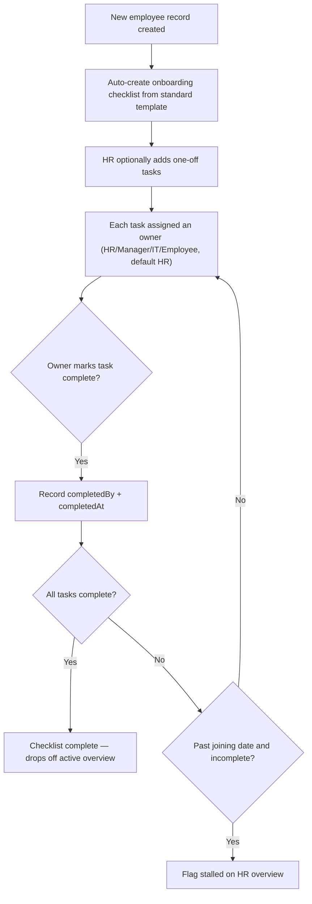
```mermaid
flowchart TD
    A["New employee record created"] --> B["Auto-create onboarding checklist from standard template"]
    B --> C["HR optionally adds one-off tasks"]
    C --> D["Each task assigned an owner (HR/Manager/IT/Employee, default HR)"]
    D --> E{"Owner marks task complete?"}
    E -- "Yes" --> F["Record completedBy + completedAt"]
    F --> G{"All tasks complete?"}
    G -- "Yes" --> H["Checklist complete — drops off active overview"]
    G -- "No" --> I{"Past joining date and incomplete?"}
    I -- "Yes" --> J["Flag stalled on HR overview"]
    I -- "No" --> D
```

### 008 — Document Management & E-Signature

Document storage & versioning:

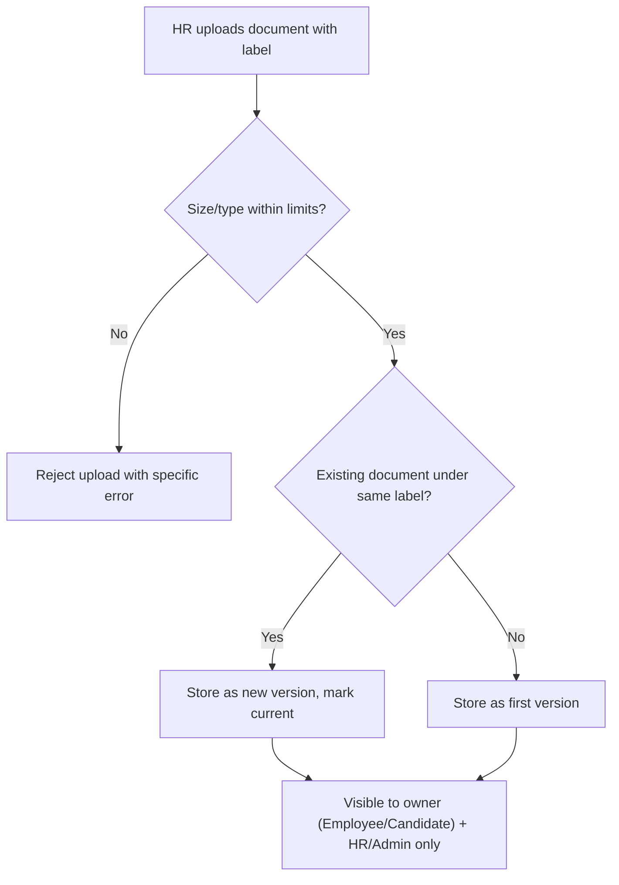
```mermaid
flowchart TD
    A["HR uploads document with label"] --> B{"Size/type within limits?"}
    B -- "No" --> C["Reject upload with specific error"]
    B -- "Yes" --> D{"Existing document under same label?"}
    D -- "Yes" --> E["Store as new version, mark current"]
    D -- "No" --> F["Store as first version"]
    E --> G["Visible to owner (Employee/Candidate) + HR/Admin only"]
    F --> G
```

E-signature & policy acknowledgment:

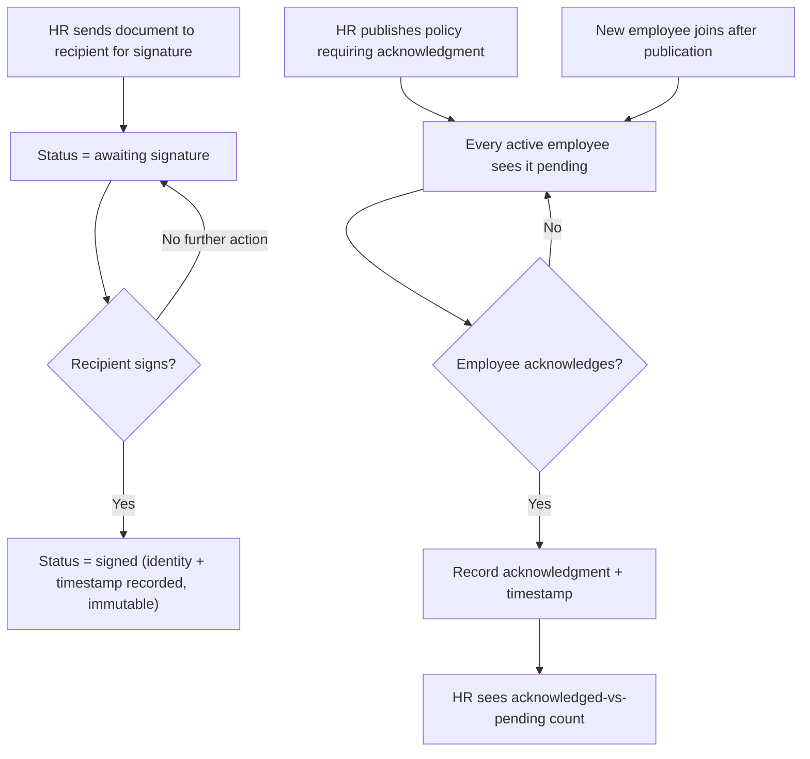
```mermaid
flowchart TD
    A["HR sends document to recipient for signature"] --> B["Status = awaiting signature"]
    B --> C{"Recipient signs?"}
    C -- "Yes" --> D["Status = signed (identity + timestamp recorded, immutable)"]
    C -- "No further action" --> B
    E["HR publishes policy requiring acknowledgment"] --> F["Every active employee sees it pending"]
    F --> G{"Employee acknowledges?"}
    G -- "Yes" --> H["Record acknowledgment + timestamp"]
    H --> I["HR sees acknowledged-vs-pending count"]
    G -- "No" --> F
    J["New employee joins after publication"] --> F
```

### 009 — Resignation & Exit Management

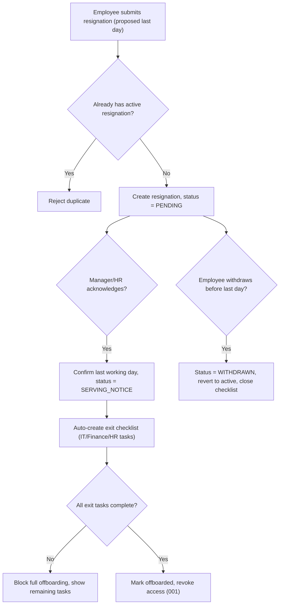
```mermaid
flowchart TD
    A["Employee submits resignation (proposed last day)"] --> B{"Already has active resignation?"}
    B -- "Yes" --> C["Reject duplicate"]
    B -- "No" --> D["Create resignation, status = PENDING"]
    D --> E{"Manager/HR acknowledges?"}
    E -- "Yes" --> F["Confirm last working day, status = SERVING_NOTICE"]
    F --> G["Auto-create exit checklist (IT/Finance/HR tasks)"]
    G --> H{"All exit tasks complete?"}
    H -- "No" --> I["Block full offboarding, show remaining tasks"]
    H -- "Yes" --> J["Mark offboarded, revoke access (001)"]
    D --> K{"Employee withdraws before last day?"}
    K -- "Yes" --> L["Status = WITHDRAWN, revert to active, close checklist"]
```

### 010 — Statutory Payroll Tax & Compliance

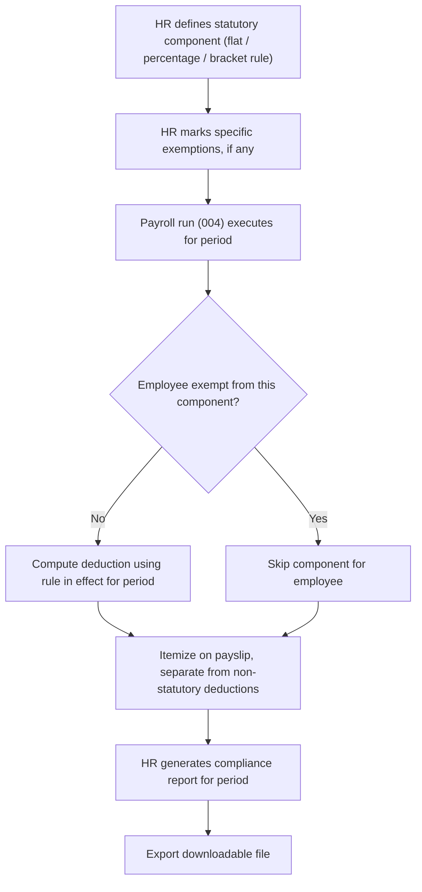
```mermaid
flowchart TD
    A["HR defines statutory component (flat / percentage / bracket rule)"] --> B["HR marks specific exemptions, if any"]
    B --> C["Payroll run (004) executes for period"]
    C --> D{"Employee exempt from this component?"}
    D -- "Yes" --> E["Skip component for employee"]
    D -- "No" --> F["Compute deduction using rule in effect for period"]
    F --> G["Itemize on payslip, separate from non-statutory deductions"]
    E --> G
    G --> H["HR generates compliance report for period"]
    H --> I["Export downloadable file"]
```

### 011 — HR Analytics & Reporting Dashboards

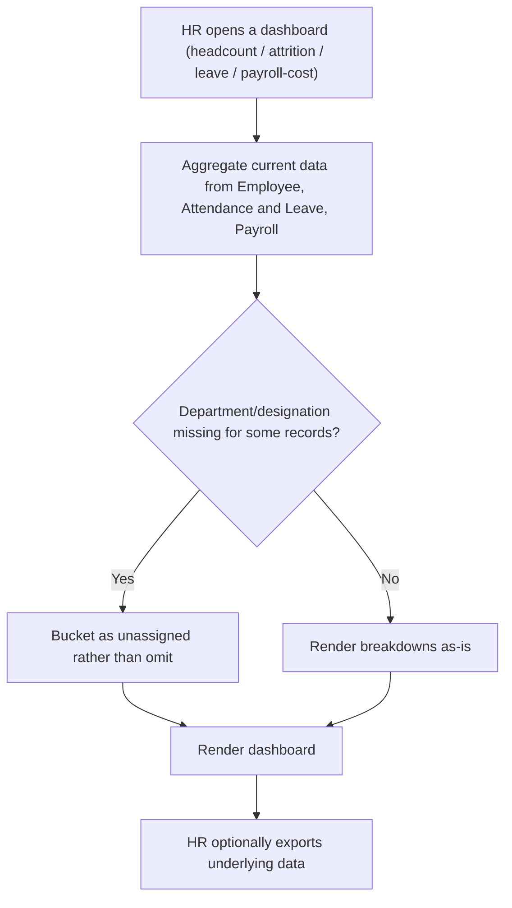
```mermaid
flowchart TD
    A["HR opens a dashboard (headcount / attrition / leave / payroll-cost)"] --> B["Aggregate current data from Employee, Attendance and Leave, Payroll"]
    B --> C{"Department/designation missing for some records?"}
    C -- "Yes" --> D["Bucket as unassigned rather than omit"]
    C -- "No" --> E["Render breakdowns as-is"]
    D --> F["Render dashboard"]
    E --> F
    F --> G["HR optionally exports underlying data"]
```

### 012 — Performance Management (Goals & Reviews)

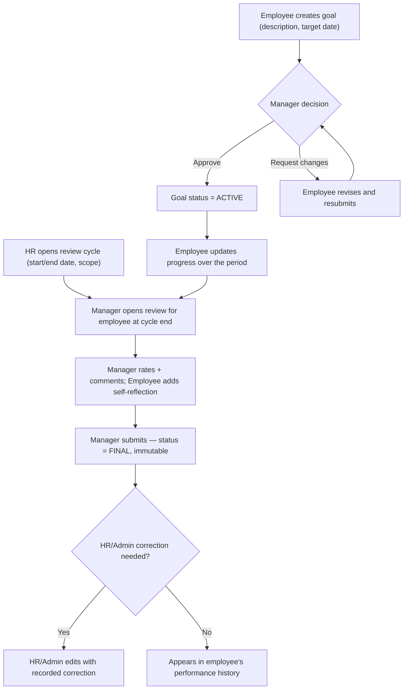
```mermaid
flowchart TD
    A["Employee creates goal (description, target date)"] --> B{"Manager decision"}
    B -- "Approve" --> C["Goal status = ACTIVE"]
    B -- "Request changes" --> D["Employee revises and resubmits"]
    D --> B
    C --> E["Employee updates progress over the period"]
    F["HR opens review cycle (start/end date, scope)"] --> G["Manager opens review for employee at cycle end"]
    E --> G
    G --> H["Manager rates + comments; Employee adds self-reflection"]
    H --> I["Manager submits — status = FINAL, immutable"]
    I --> J{"HR/Admin correction needed?"}
    J -- "Yes" --> K["HR/Admin edits with recorded correction"]
    J -- "No" --> L["Appears in employee's performance history"]
```

### 013 — SSO & Multi-Factor Authentication

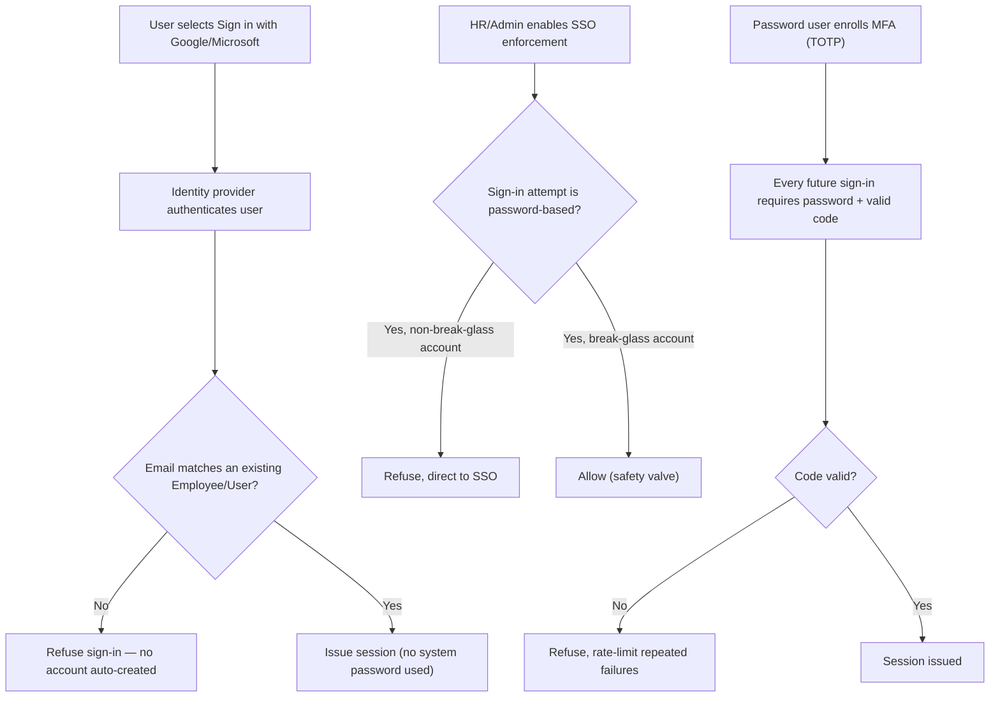
```mermaid
flowchart TD
    A["User selects Sign in with Google/Microsoft"] --> B["Identity provider authenticates user"]
    B --> C{"Email matches an existing Employee/User?"}
    C -- "No" --> D["Refuse sign-in — no account auto-created"]
    C -- "Yes" --> E["Issue session (no system password used)"]
    F["HR/Admin enables SSO enforcement"] --> G{"Sign-in attempt is password-based?"}
    G -- "Yes, non-break-glass account" --> H["Refuse, direct to SSO"]
    G -- "Yes, break-glass account" --> I["Allow (safety valve)"]
    J["Password user enrolls MFA (TOTP)"] --> K["Every future sign-in requires password + valid code"]
    K --> L{"Code valid?"}
    L -- "No" --> M["Refuse, rate-limit repeated failures"]
    L -- "Yes" --> N["Session issued"]
```

### 014 — Asset & Expense Management

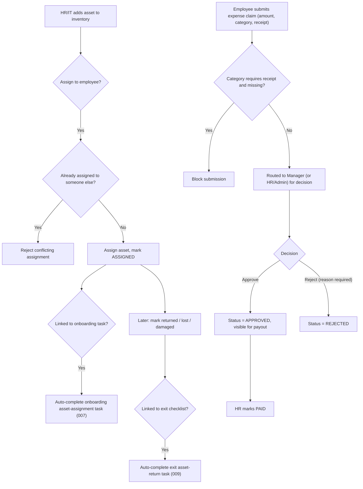
```mermaid
flowchart TD
    A["HR/IT adds asset to inventory"] --> B{"Assign to employee?"}
    B -- "Yes" --> C{"Already assigned to someone else?"}
    C -- "Yes" --> D["Reject conflicting assignment"]
    C -- "No" --> E["Assign asset, mark ASSIGNED"]
    E --> F{"Linked to onboarding task?"}
    F -- "Yes" --> G["Auto-complete onboarding asset-assignment task (007)"]
    E --> H["Later: mark returned / lost / damaged"]
    H --> I{"Linked to exit checklist?"}
    I -- "Yes" --> J["Auto-complete exit asset-return task (009)"]
    K["Employee submits expense claim (amount, category, receipt)"] --> L{"Category requires receipt and missing?"}
    L -- "Yes" --> M["Block submission"]
    L -- "No" --> N["Routed to Manager (or HR/Admin) for decision"]
    N --> O{"Decision"}
    O -- "Approve" --> P["Status = APPROVED, visible for payout"]
    O -- "Reject (reason required)" --> Q["Status = REJECTED"]
    P --> R["HR marks PAID"]
```

### 015 — Multi-Company / Multi-Tenant Activation

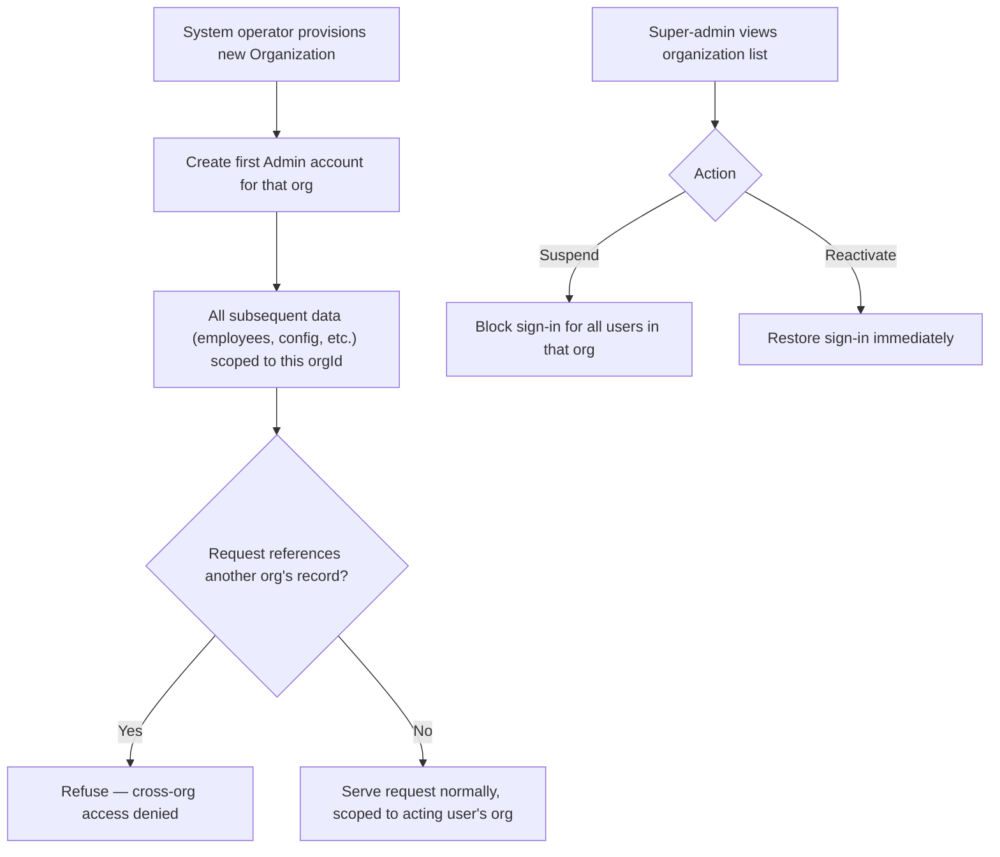
```mermaid
flowchart TD
    A["System operator provisions new Organization"] --> B["Create first Admin account for that org"]
    B --> C["All subsequent data (employees, config, etc.) scoped to this orgId"]
    C --> D{"Request references another org's record?"}
    D -- "Yes" --> E["Refuse — cross-org access denied"]
    D -- "No" --> F["Serve request normally, scoped to acting user's org"]
    G["Super-admin views organization list"] --> H{"Action"}
    H -- "Suspend" --> I["Block sign-in for all users in that org"]
    H -- "Reactivate" --> J["Restore sign-in immediately"]
```

---

## v1.2 — Completeness additions

### 016 — Interactive Org Chart

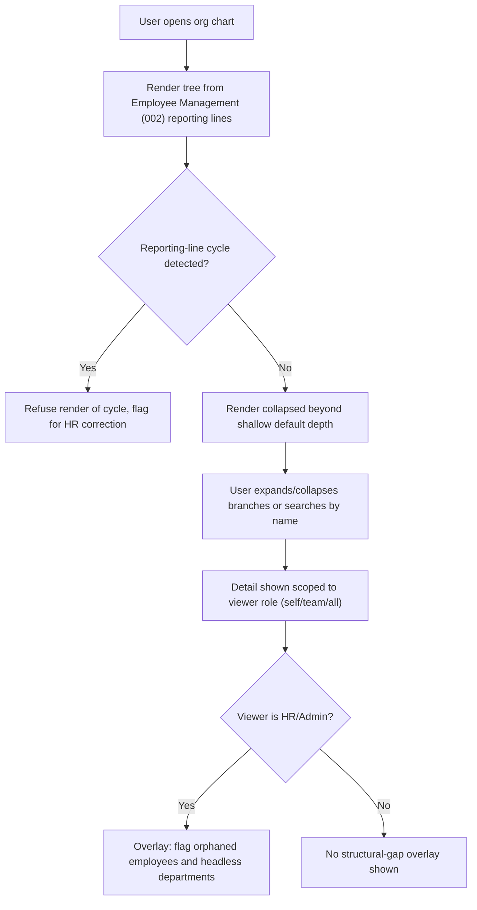
```mermaid
flowchart TD
    A["User opens org chart"] --> B["Render tree from Employee Management (002) reporting lines"]
    B --> C{"Reporting-line cycle detected?"}
    C -- "Yes" --> D["Refuse render of cycle, flag for HR correction"]
    C -- "No" --> E["Render collapsed beyond shallow default depth"]
    E --> F["User expands/collapses branches or searches by name"]
    F --> G["Detail shown scoped to viewer role (self/team/all)"]
    G --> H{"Viewer is HR/Admin?"}
    H -- "Yes" --> I["Overlay: flag orphaned employees and headless departments"]
    H -- "No" --> J["No structural-gap overlay shown"]
```

### 017 — HR Helpdesk / Ticketing

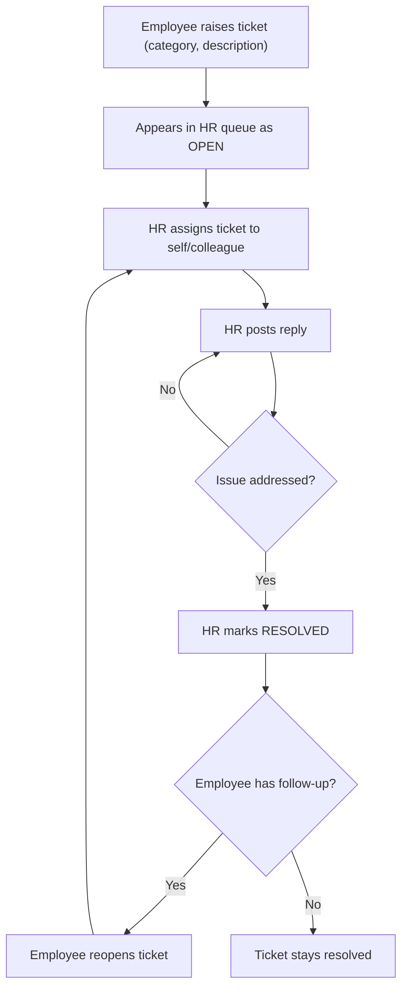
```mermaid
flowchart TD
    A["Employee raises ticket (category, description)"] --> B["Appears in HR queue as OPEN"]
    B --> C["HR assigns ticket to self/colleague"]
    C --> D["HR posts reply"]
    D --> E{"Issue addressed?"}
    E -- "No" --> D
    E -- "Yes" --> F["HR marks RESOLVED"]
    F --> G{"Employee has follow-up?"}
    G -- "Yes" --> H["Employee reopens ticket"]
    H --> C
    G -- "No" --> I["Ticket stays resolved"]
```

### 018 — Employee Engagement & Pulse Surveys

```mermaid
flowchart TD
    A["HR creates survey (questions incl. eNPS, audience)"] --> B["Survey sent to audience, status = OPEN"]
    B --> C{"Employee already responded (participation record)?"}
    C -- "Yes" --> D["Reject duplicate submission"]
    C -- "No" --> E["Employee submits anonymous response"]
    E --> F["Mark participation (no identity link to answers)"]
    F --> G{"Responses >= minimum threshold?"}
    G -- "No" --> H["Show not enough responses to HR"]
    G -- "Yes" --> I["Compute aggregate eNPS + show results"]
    I --> J["HR views trend across closed surveys"]
```

### 019 — Mobile App / Progressive Web App

```mermaid
flowchart TD
    A["User installs PWA to home screen"] --> B["Opens app — same auth/session as desktop"]
    B --> C["Check-in/out (003) — identical behavior to desktop"]
    B --> D["File leave / approve leave (003) — identical behavior to desktop"]
    D --> E{"Network interrupted mid-action?"}
    E -- "Yes, retried" --> F["De-duplicated — no double effect"]
    E -- "No" --> G["Action completes normally"]
    H["Notifiable event occurs (006)"] --> I{"Push enabled?"}
    I -- "Yes" --> J["Push notification delivered"]
    J --> K["Tap opens directly to relevant record"]
    I -- "No" --> L["In-app notification center still reflects event"]
```

### 020 — Public Careers Page & Candidate Self-Apply

```mermaid
flowchart TD
    A["Anonymous visitor opens public careers page"] --> B["See only OPEN postings"]
    B --> C["Visitor submits self-application (name, contact, resume)"]
    C --> D{"Posting still open? Bot check passes?"}
    D -- "No" --> E["Reject application"]
    D -- "Yes" --> F{"Duplicate candidate+posting?"}
    F -- "Yes" --> E
    F -- "No" --> G["Create Candidate + Application at first pipeline stage (005)"]
    G --> H["Confirmation shown to candidate"]
    H --> I["Candidate later checks status via email lookup"]
    I --> J{"Match found?"}
    J -- "No" --> K["Generic no matching application message"]
    J -- "Yes" --> L["Show current/terminal stage"]
```

### 021 — Employee Referral Program

```mermaid
flowchart TD
    A["Employee submits referral (candidate + posting)"] --> B{"Duplicate candidate+posting?"}
    B -- "Yes" --> C["Reject duplicate"]
    B -- "No" --> D["Create Candidate + Application tagged with referrer (005)"]
    D --> E{"Application reaches HIRED?"}
    E -- "No (rejected)" --> F["Referral closes — no bonus"]
    E -- "Yes" --> G["Bonus = PENDING, qualifying period starts"]
    G --> H{"Hire still active when period elapses?"}
    H -- "No (exited early)" --> I["Bonus = FORFEITED"]
    H -- "Yes" --> J["Bonus = PAYABLE"]
    J --> K["HR includes bonus as one-off earning on payroll run (004)"]
    K --> L["Bonus = PAID, itemized on payslip"]
```

### 022 — Background Verification

```mermaid
flowchart TD
    A["HR initiates background check with items"] --> B["Check status = PENDING/IN_PROGRESS"]
    B --> C["HR/verifier records result per item (cleared/flagged/unable to verify)"]
    C --> D{"All items have a result?"}
    D -- "No" --> C
    D -- "Yes" --> E["Check status = COMPLETE, overall outcome derived"]
    E --> F{"Application moved to HIRED?"}
    F -- "Yes, check incomplete" --> G["Block, unless HR override with reason"]
    F -- "Yes, check complete and flagged" --> H["Require written justification"]
    F -- "Yes, check complete and cleared" --> I["Proceed, no justification needed"]
    F -- "No, application rejected instead" --> J["Rejection recorded, flag retained as context"]
```

### 023 — Learning & Development

```mermaid
flowchart TD
    A["HR creates course"] --> B["HR assigns to employees/department/company (due date)"]
    B --> C{"Compliance-required?"}
    C -- "Yes" --> D["New joiners auto-included going forward"]
    C -- "No" --> E["New joiners NOT retroactively included"]
    D --> F["Employee views assignment"]
    E --> F
    F --> G{"Requires proof upload?"}
    G -- "Yes" --> H{"Proof attached?"}
    H -- "No" --> I["Block completion"]
    H -- "Yes" --> J["Mark complete + completion date"]
    G -- "No" --> J
    J --> K{"Past due date and still incomplete?"}
    K -- "Yes" --> L["Flag overdue"]
    C -- "Yes" --> M["HR compliance dashboard: completed vs outstanding"]
```

### 024 — Succession Planning

```mermaid
flowchart TD
    A["HR marks an employee's position as critical"] --> B["Position appears on succession overview needing a plan"]
    B --> C["HR adds successor(s) with readiness level"]
    C --> D{"Proposed successor is an active employee?"}
    D -- "No" --> E["Reject — must be active internal employee"]
    D -- "Yes" --> F["Add to succession plan"]
    F --> G{"Successor later offboarded?"}
    G -- "Yes" --> H["Auto-flag invalid on all plans, history retained"]
    G -- "No" --> I["Remains valid, readiness updatable over time"]
    F --> J["HR overview categorizes: no successor / not ready / ready now"]
```

### 025 — White-Labeling / Per-Tenant Branding

```mermaid
flowchart TD
    A["Org Admin uploads logo + picks brand color"] --> B{"Logo size/type valid? Color passes contrast check?"}
    B -- "No" --> C["Reject with specific error / warning"]
    B -- "Yes" --> D["Save OrganizationBranding"]
    D --> E["Applied across that org's app shell (nav, login) for its users only"]
    D --> F["Applied to generated payslip PDFs (004)"]
    D --> G["Applied to public careers page, if active (020)"]
    H["Org has no branding configured"] --> I["Falls back to TeamLoom default branding"]
```

### 026 — Global / Multi-Currency Payroll

```mermaid
flowchart TD
    A["HR assigns employee a payroll country + currency"] --> B{"Country/currency set before payroll run?"}
    B -- "No" --> C["Block payslip generation, report missing config"]
    B -- "Yes" --> D["Payroll run (004) processes employee using their country's statutory rules (010)"]
    D --> E["Payslip expressed in employee's assigned currency"]
    E --> F["Run produces payslips across multiple countries, grouped/labeled by country"]
    F --> G{"Reporting currency total requested?"}
    G -- "Yes, rate recorded for period" --> H["Convert and sum using recorded exchange rate"]
    G -- "Yes, rate missing" --> I["Clearly indicate missing rate, do not silently omit"]
```

### 027 — HR Assistant Chatbot

```mermaid
flowchart TD
    A["Employee asks a plain-language question"] --> B{"Question about personal HR data?"}
    B -- "Yes" --> C{"Within asker's own RBAC scope (001)?"}
    C -- "No" --> D["Refuse — never exceeds asker's own access"]
    C -- "Yes" --> E["Answer grounded in actual current record (003/004/010/014)"]
    B -- "No (policy question)" --> F{"Matching published policy/setting exists (008)?"}
    F -- "Yes" --> G["Answer grounded in policy content, cite source"]
    F -- "No" --> H["Decline — state no answer available"]
    E --> I["Log anonymized topic (no identity link) for HR overview"]
    G --> I
    H --> I
```
